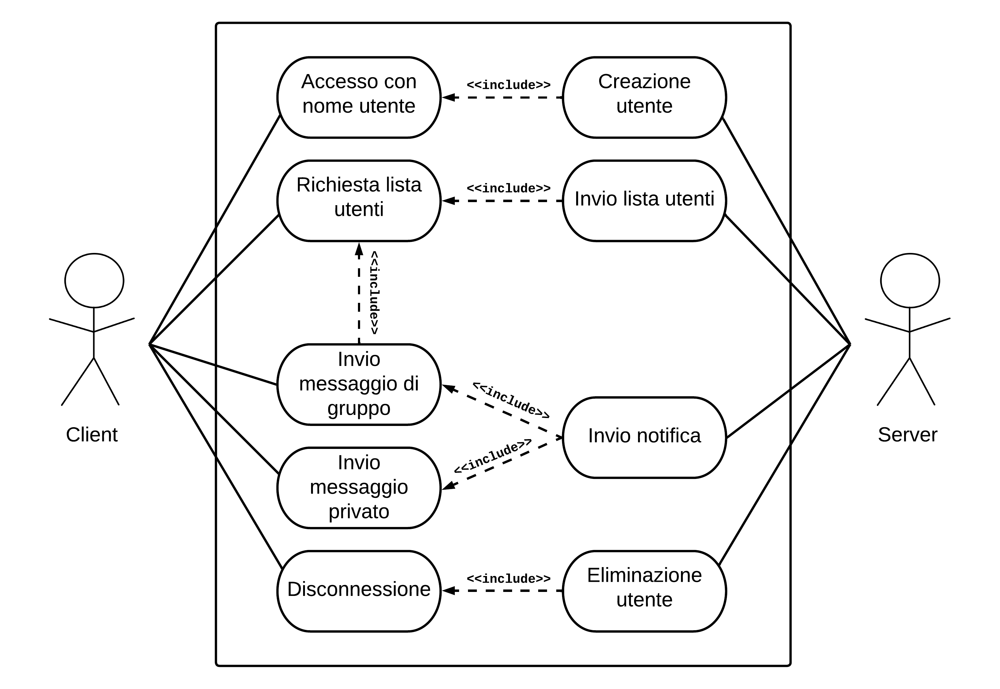

# Una semplice implementazione Java di JCSP.
Questo progetto è una semplice chat CLI scritta in Java 11 (Maven) che utilizza il protocollo JCSP
per le comunicazioni client-server.

---

- [Documentazione del protocollo JCSP](./jcsp.pdf)

- [Documentazione Javadoc della chat](https://lotti-meucci.github.io/chat/)

---

## Semplice diagramma dei casi d'uso

